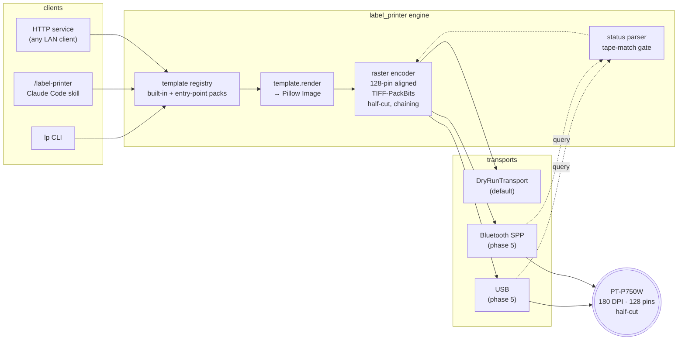
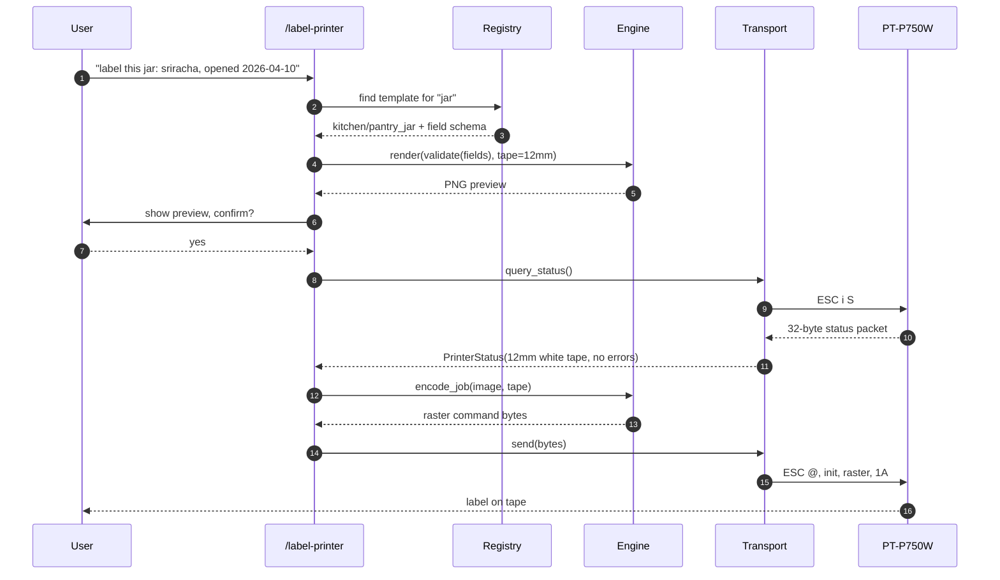
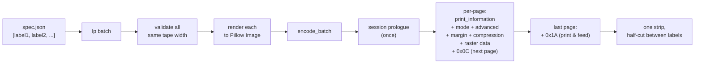
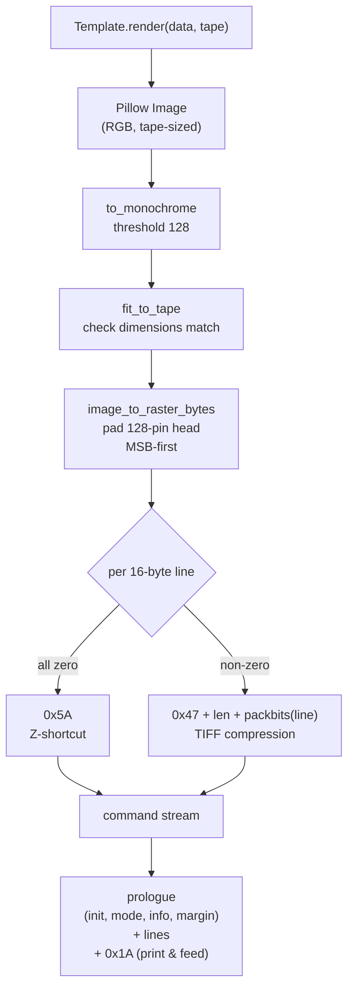
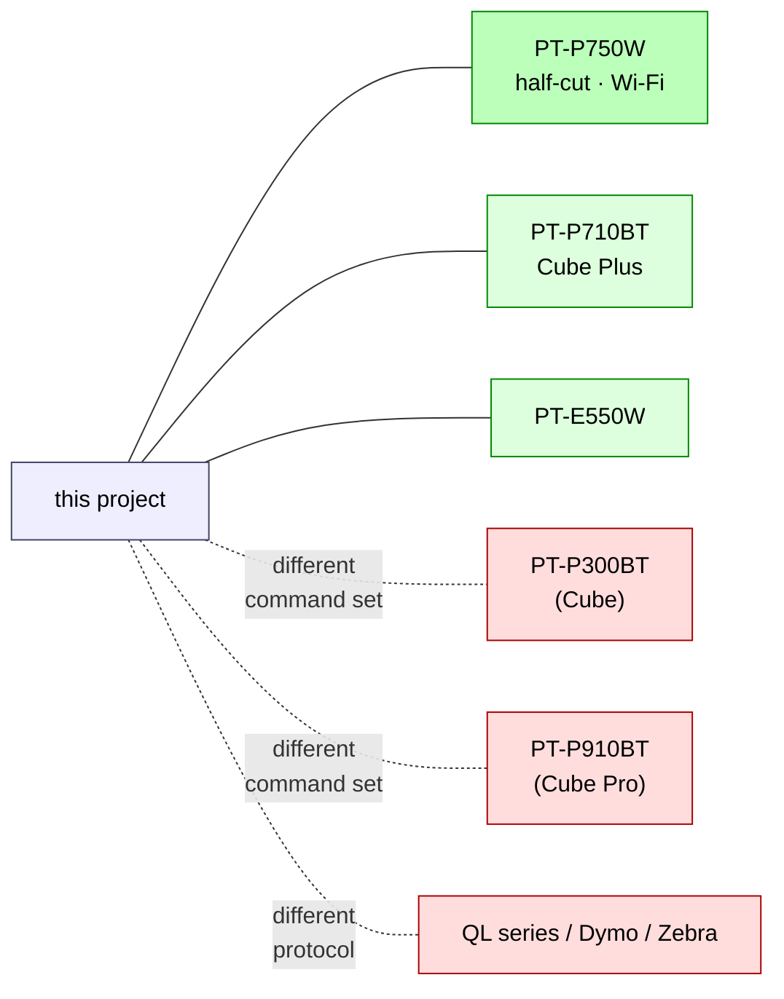

# brother-ptouch-automation

[](https://aes87.github.io/brother-ptouch-automation/)
[](https://github.com/aes87/brother-ptouch-automation/actions/workflows/ci.yml)
[](LICENSE)

**Template-driven label automation for the Brother PT-P750W** (primary target) and its raster-compatible siblings **PT-P710BT** and **PT-E550W**. One engine, three surfaces — a CLI, an HTTP service, and a Claude Code skill — on top of a byte-exact raster encoder.

Print a pantry jar, a cable flag sized to the exact cable it's wrapping, a filament spool, a QR code, or a twenty-label spice rack batch — from a terminal, a web request, or a chat message.

> ### 🌐 [Live demo: browse every template →](https://aes87.github.io/brother-ptouch-automation/)
>
> All 36 templates across 12 packs, with live search, pack filters, field schemas, and copy-paste CLI examples for each one.


## Why

The Brother P-touch Editor app is fine for a one-off, but it's terrible at the workflows you actually want:

- Labelling ten jars in a row without clicking through a GUI every time
- Printing from a script, a scheduled job, or a chatbot
- Sharing a template library across projects
- Getting the *same* label twice in a row, reliably

This is a small, fast automation layer that fixes those. Templates are Python classes with validated field schemas. The raster encoder is byte-exact against Brother's official command reference. The three surfaces (CLI, HTTP service, Claude Code skill) all call the same engine, so a label triggered from Claude comes off the tape identical to one triggered from the shell.

## Features

### Engine
- **Byte-exact** raster encoder, cross-checked against [`treideme/brother_pt`](https://github.com/treideme/brother_pt) in CI — every byte the printer receives is verified against a known-good reference at the raster-bytes layer
- **Tape-aware** — print-head geometry handled for every supported TZe width (3.5 / 6 / 9 / 12 / 18 / 24 mm)
- **Half-cut** — enabled by default on PT-P750W so chained labels come off the printer as a single strip attached by the liner; silently ignored on hardware without the mechanism
- **Multi-label batch jobs** — one prologue, per-page raster blocks, `0x0C` separators, `0x1A` terminator. `lp batch spec.json` prints twenty spice-rack labels in one run with half-cuts between each.
- **Tape-status autodetect** — parses the 32-byte status reply (loaded width, media type, tape colour, text colour, 7 distinct error flags). Real sends can be gated on "the loaded tape matches what this job wants" so you never waste tape on a mismatch.

### Templates
- **36 templates across 12 packs** — kitchen / electronics / 3D printing / utility / garden / networking / workshop / home-inventory / media / pet / travel / calibration. [Browse the interactive gallery](https://aes87.github.io/brother-ptouch-automation/).
- **Wire-aware cable flags** — pass `wire=ethernet` or `wire=18AWG` and the wrap section is sized to the cable's outer diameter (π·OD + adhesive overlap); 40+ cable keywords plus AWG 0–30 built in
- **QR codes + images** as first-class template types — no "design it in Photoshop first"
- **Icons** — ~50 bundled Lucide icons that templates can opt in to via an `icon=` field; install the full Lucide (~1500) or Material Design Icons (~7000) sets with `lp icons install-lucide` / `lp icons install-mdi`
- **Pack plug-in system** — ship your own templates as a separate pip package. External packs register via standard Python entry points. See [`docs/creating-a-pack.md`](docs/creating-a-pack.md).

### Safety
- **Dry-run by default** — `lp print` and `lp batch` encode + write bytes to a file but never drive the transport unless you add `--send`. The printer never moves unexpectedly.
- **Supply-chain aware** — external template packs can be disabled with `LABEL_PRINTER_DISABLE_ENTRY_POINT_PACKS=1`; broken packs are isolated per-pack, one bad install never bricks the CLI

### Surfaces
- **`lp` CLI** — fast, scriptable, friendly
- **HTTP service** — FastAPI with optional bearer-token auth, so the printer can live on one machine and clients call it from anywhere on the LAN
- **Claude Code skill** — install the symlink and any Claude session can discover templates, propose labels, and print them

### Quality
- **170+ tests**, ruff clean, CI green on every push

## Architecture



**Key separation**: templates produce a Pillow `Image` sized for the loaded tape; the engine converts it to a Brother raster command stream; transports only care about `send(bytes)`. Clients never touch transport code. Swapping from a local printer to a network service or migrating to a different host is zero-template-change work.

## Template gallery

**36 templates across 12 packs** — kitchen, electronics, 3D printing, utility, garden, networking, workshop, home-inventory, media, pet, travel, calibration.

👉 **[Interactive demo with every template, field schema, and copy-paste CLI example →](https://aes87.github.io/brother-ptouch-automation/)**

A sample below. Every template renders at 180 DPI, drop straight onto a TZe cassette.

| Pack | Template | Preview |
|---|---|---|
| `kitchen/` | `pantry_jar` |  <br> with icon:  |
| `kitchen/` | `spice` |  |
| `kitchen/` | `leftover` |  |
| `kitchen/` | `freezer` |  |
| `electronics/` | `cable_flag` |  |
| `electronics/` | `component_bin` |  |
| `electronics/` | `psu_polarity` |  |
| `three_d_printing/` | `filament_spool` |  |
| `three_d_printing/` | `print_bin` |  |
| `three_d_printing/` | `tool_tag` |  |
| `utility/` | `qr` |  |
| `utility/` | `image` | arbitrary bitmap + optional caption |

### Wire-aware cable flags

Pass the cable type as plain language and the wrap section (the part that goes around the cable) is sized from its outer diameter:

| `wire=` | OD | Preview |
|---|---|---|
| `24AWG` (hookup wire) | 1.4 mm |  |
| `ethernet` (Cat6 patch) | 5.5 mm |  |
| `extension-cord` | 10.0 mm |  |

Supported out of the box: `ethernet`, `cat5/5e/6/6a/7/8`, `coax`, `hdmi`, `displayport`, `usb/usb-c/micro-usb`, `lightning`, `thunderbolt`, `ac`, `iec-c13`, `extension-cord`, `lamp-cord`, `xlr`, `trs`, `rca`, `sata`, `molex`, `jst`, `dupont`, `romex-12/14/10`, AWG 0–30, or a literal `"5mm"`. Run `lp wires` for the full list.

## Quickstart

```bash
git clone https://github.com/aes87/brother-ptouch-automation.git
cd brother-ptouch-automation
python3.11 -m venv .venv
.venv/bin/pip install -e '.[barcode,service,icons]'

# Discover what's shipped
.venv/bin/lp packs            # installed template packs (built-in + entry-point)
.venv/bin/lp list             # all templates
.venv/bin/lp show kitchen/pantry_jar

# Dry-render a PNG + raster command stream (no printing)
.venv/bin/lp render kitchen/pantry_jar \
  -f name="AP Flour" -f purchased=2026-04-19 \
  --png-out flour.png --bin-out flour.bin

# Pantry jar with an icon (opt-in; icons extra pulls cairosvg)
# wheat for flour, egg for eggs, leaf for herbs, carrot for root veg — pick what fits
.venv/bin/lp render kitchen/pantry_jar \
  -f name="AP Flour" -f purchased=2026-04-19 -f icon=wheat \
  --png-out flour-with-icon.png

# QR code with caption
.venv/bin/lp render utility/qr \
  -f data=https://github.com/aes87/brother-ptouch-automation \
  -f caption=repo \
  --png-out qr.png

# Cable flag, auto-sized for the cable
.venv/bin/lp render electronics/cable_flag \
  -f source=NAS -f dest="SWITCH p3" -f wire=ethernet \
  --png-out cable.png

# Batch-print a whole spice rack as one chained job (half-cut between each)
cat > rack.json <<EOF
[
  {"template": "kitchen/spice", "tape_mm": 12, "fields": {"name": "Paprika"}},
  {"template": "kitchen/spice", "tape_mm": 12, "fields": {"name": "Cumin"}},
  {"template": "kitchen/spice", "tape_mm": 12, "fields": {"name": "Oregano"}}
]
EOF
.venv/bin/lp batch rack.json

# When hardware lands: verify the right tape is loaded, then actually print
.venv/bin/lp status           # parses the printer's status packet
.venv/bin/lp batch rack.json --send
```

## Three surfaces

### CLI

```bash
# discover
lp packs                               # installed template packs
lp list [--category kitchen]           # templates in a pack
lp show <category>/<name>              # field schema for a template
lp tape-info                           # print-head geometry per tape
lp wires                               # cable-keyword → outer-diameter table
lp icons list [--source]               # bundled Lucide icons

# render (safe — no transport touched)
lp render <template> -f k=v ...        # PNG + raster preview
lp render-image <file.png>             # raster-encode an arbitrary image

# print — dry-run default, --send opt-in
lp print <template> -f k=v ...         # single label
lp print <template> -f k=v ... --send  # really print
lp batch <spec.json>                   # chained multi-label job (half-cut)
lp batch <spec.json> --send            # ditto, send for real

# hardware (Phase 5)
lp status                              # loaded tape + error flags
lp scan                                # discover attached printers

# config
lp tape <mm>                           # persist current tape width
lp icons install-lucide                # clone ~1500 Lucide icons to ~/.config
lp icons install-mdi                   # clone ~7000 Material Design Icons

# service
lp serve --host 127.0.0.1 --port 8765  # FastAPI HTTP service
```

`lp print` and `lp batch` are **dry-run by default** — they encode the job and write the raster command stream to `--bin-out`, but never touch the printer. Add `--send` to actually drive the transport. The HTTP service mirrors the same contract: `POST /print` is dry-run by default, set `"send": true` in the body to drive the transport.

### HTTP service

```bash
export LABEL_PRINTER_TOKEN=s3cret     # optional bearer-token auth
lp serve --host 127.0.0.1 --port 8765
```

```bash
curl -s http://127.0.0.1:8765/templates | jq .

# Render returns a PNG
curl -X POST http://127.0.0.1:8765/render \
  -H 'Authorization: Bearer s3cret' \
  -H 'Content-Type: application/json' \
  -d '{"template":"utility/qr","tape_mm":12,"fields":{"data":"https://example.com","caption":"site"}}' \
  --output qr.png

# Print — dry-run returns the raster bytes; set send:true to drive the transport
curl -X POST http://127.0.0.1:8765/print \
  -H 'Content-Type: application/json' \
  -d '{"template":"kitchen/spice","tape_mm":12,"fields":{"name":"Paprika"},"send":true}'
```

Endpoints: `GET /health`, `GET /templates`, `POST /render`, `POST /print`.

### Claude Code skill

The `skill/` directory is a Claude Code skill. Symlink it into `~/.claude/skills/label-printer/` and Claude sessions can print labels:

```bash
ln -s "$(pwd)/skill" ~/.claude/skills/label-printer
```

From any Claude session:

> "label this jar — sriracha, opened 2026-04-10"

Claude picks the right template, proposes fields, dry-renders a PNG for you to review, and only prints once you approve.

## Job lifecycle



## Multi-label batch workflow



## How a single label is encoded



## Extending it

### Add a single template to an existing pack

Drop a file in `src/label_printer/templates/<pack>/<name>.py` and register it in the pack's `__init__.py`:

```python
from PIL import Image
from label_printer.engine.layout import (
    LabelCanvas, TwoLineLayout, draw_row,
    fit_text_to_box, load_font,
    DEFAULT_BOLD, DEFAULT_FONT,
    mm_to_dots, text_width,
)
from label_printer.tape import TapeWidth
from label_printer.templates.base import Template, TemplateField, TemplateMeta


class SeedPacketTemplate(Template):
    meta = TemplateMeta(
        category="garden",
        name="seed_packet",
        summary="Seed packet: variety + sow-by.",
        fields=[
            TemplateField("variety", "Cultivar.", example="Brandywine tomato"),
            TemplateField("sow_by", "Sow-by date.", example="2026-05-15"),
        ],
        default_tape=TapeWidth.MM_12,
    )

    def render(self, data, tape):
        name = str(data["variety"])
        sub = f"sow by {data['sow_by']}"
        layout = TwoLineLayout(tape=tape)
        name_font = fit_text_to_box(name, mm_to_dots(100), layout.primary_h, DEFAULT_BOLD)
        sub_font = load_font(DEFAULT_FONT, layout.secondary_h - 2)
        length = max(text_width(name, name_font), text_width(sub, sub_font)) + mm_to_dots(6)
        canvas = LabelCanvas.create(tape, length_mm=length * 25.4 / 180)
        draw_row(canvas, name, name_font, layout.primary_y)
        draw_row(canvas, sub, sub_font, layout.secondary_y)
        return canvas.image
```

### Ship a whole pack as a separate pip package

Your users can `pip install label-printer-ham-radio` and get your templates alongside the built-ins. The pack registers via standard Python entry points:

```toml
# In your package's pyproject.toml
[project.entry-points."label_printer.packs"]
ham_radio = "label_printer_ham:PACK"
```

Full walkthrough in [`docs/creating-a-pack.md`](docs/creating-a-pack.md). The doc also covers the trust model, collision rules, and the `LABEL_PRINTER_DISABLE_ENTRY_POINT_PACKS=1` safe-mode escape hatch.

## Hardware & compatibility



- **Primary target: Brother PT-P750W** — 180 DPI, 128-pin head, TZe tapes 3.5–24 mm, USB + Wi-Fi, half-cut supported
- **Also works** with **PT-P710BT** ("Cube Plus") and **PT-E550W** — same raster command reference, same 128-pin head. The P710BT lacks half-cut hardware but silently ignores the bit.
- **Does not work** with the smaller **PT-P300BT** (Cube, original) or the **PT-P910BT** (Cube Pro) — different command sets and different head geometry
- **Does not work** with Brother QL shipping-label printers or with Dymo / Zebra / Epson — completely different protocols

The encoder targets Brother's [Raster Command Reference for PT-E550W / PT-P750W / PT-P710BT](https://download.brother.com/welcome/docp100064/cv_pte550wp750wp710bt_eng_raster_102.pdf).

## Roadmap

- [x] **Phase 1** — raster encoder + `DryRunTransport` + byte goldens + cross-check against `brother_pt`
- [x] **Phase 2** — template engine + registry + template packs (kitchen / electronics / 3D-printing / utility)
- [x] **Phase 3** — CLI + HTTP service + Claude Code skill, all on `DryRunTransport`
- [x] **Pack primitive** — `TemplatePack` dataclass, `label_printer.packs` entry-point group, external packs as standalone pip packages
- [x] **Half-cut + multi-label batch** — chained print jobs with partial cuts between labels (PT-P750W)
- [x] **Icon engine** — curated Lucide bundle + optional full-set installers, opt-in per template
- [x] **Status parsing** — 32-byte packet decoded, `ensure_tape_matches()` gate for real sends
- [ ] **Phase 4** — chat-bridge integration (Telegram / Slack) in dry-run
- [ ] **Phase 5** — USB + Bluetooth transports, first physical prints, live tape-match gating
- [ ] **Phase 6** — `lp print --remote <host>` for running the service on a dedicated machine

### Open proposals

- [Proposal 0001 — QR-code context linking](docs/proposals/0001-qr-context-linking.md) (open): let any label carry a small QR pointing at its canonical source of truth in an Obsidian vault or a GitHub repo. Resolved by Claude from a photo — no URL scheme drama, no hosted redirect, no "Obsidian not installed" dead-ends.

See [`docs/implementation-plan.md`](docs/implementation-plan.md) for the full phased plan.

## Development

```bash
.venv/bin/pytest                  # 124 tests — unit + integration
.venv/bin/pytest -m hardware      # transport tests, require the physical printer
.venv/bin/ruff check src tests
```

Regenerate byte goldens after an intentional encoder change:

```bash
REGEN_GOLDENS=1 .venv/bin/pytest tests/test_raster_encoder.py
```

Safe mode (skip all entry-point-registered external packs):

```bash
LABEL_PRINTER_DISABLE_ENTRY_POINT_PACKS=1 lp list
```

## Credits

Built from Brother's [official raster command manual](https://download.brother.com/welcome/docp100064/cv_pte550wp750wp710bt_eng_raster_102.pdf), informed by two excellent open-source implementations:

- [treideme/brother_pt](https://github.com/treideme/brother_pt) — Python USB driver, Apache 2.0
- [robby-cornelissen/pt-p710bt-label-maker](https://github.com/robby-cornelissen/pt-p710bt-label-maker) — Python Bluetooth driver

Bundled icons are [Lucide](https://lucide.dev/) (ISC) — see [`assets/icons/LICENSE-Lucide.txt`](assets/icons/LICENSE-Lucide.txt). Bundled fonts are DejaVu (Bitstream Vera derivative) — see [`assets/fonts/LICENSE-DejaVu.txt`](assets/fonts/LICENSE-DejaVu.txt). Full dependency list and license attributions in [`CREDITS.md`](CREDITS.md).

## License

MIT — see [`LICENSE`](LICENSE).
