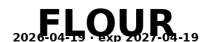
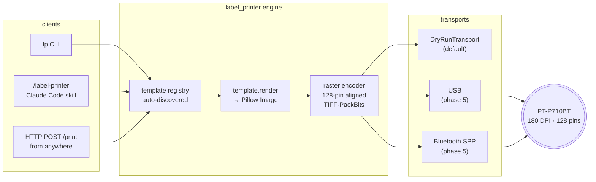
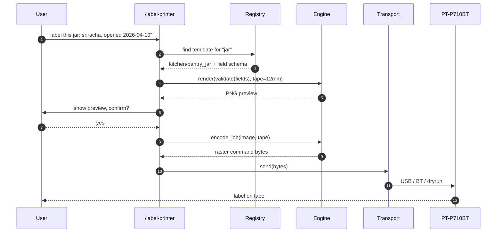
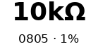
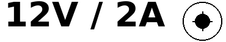
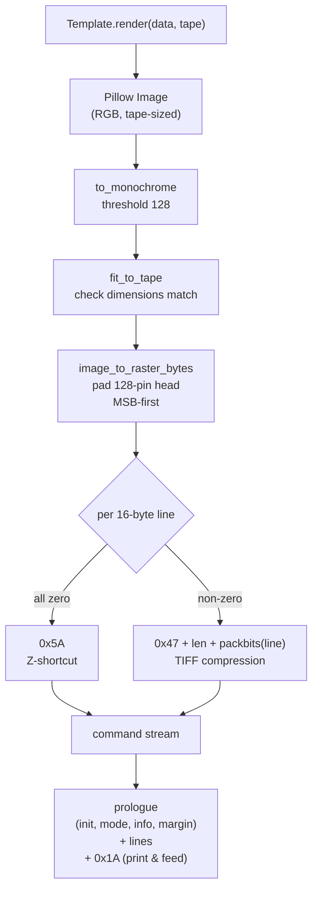
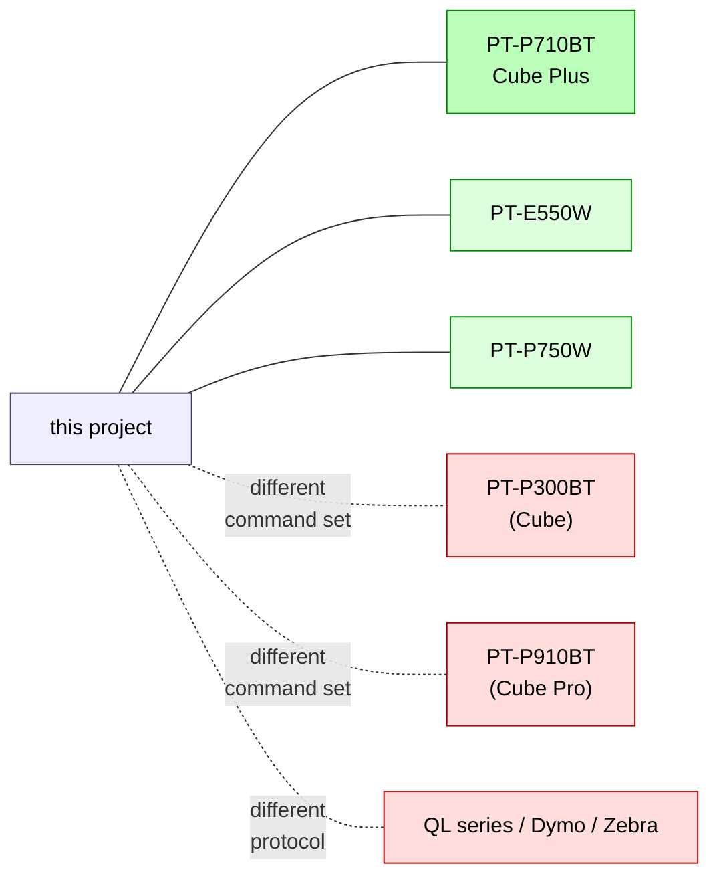

# brother-ptouch-automation

**Template-driven label automation for the Brother P-touch Cube Plus (PT-P710BT).** One engine, three surfaces — a CLI, an HTTP service, and a Claude Code skill — on top of a byte-exact raster encoder.

Print a pantry jar, a cable flag sized to the cable it's wrapping, a filament spool, or a QR code from a terminal, a web request, or a chat message. Same engine, same output.




## Why

The Brother P-touch Editor app is fine for a one-off, but it's terrible at the workflows you actually want:

- Labelling ten jars in a row without clicking through a GUI every time
- Printing from a script, a scheduled job, or a chatbot
- Sharing a template library across projects
- Getting the *same* label twice in a row, reliably

This project is a small, fast automation layer that fixes those. Templates are Python classes with validated field schemas. The raster encoder is byte-exact against Brother's official command reference. The three surfaces (CLI, HTTP service, Claude Code skill) all call the same engine, so a label triggered from Claude comes off the tape identical to one triggered from the shell.

## Features

- **12 templates out of the box** across kitchen, electronics, 3D-printing, and utility (QR codes, arbitrary images) — add your own template, or your own whole pack as a separate pip package (see [`docs/creating-a-pack.md`](docs/creating-a-pack.md))
- **Wire-aware cable flags** — pass `wire=ethernet` or `wire=18AWG` and the wrap section is sized to the cable's circumference
- **QR codes + images** directly from the CLI or service (no "design it in Photoshop first")
- **Byte-exact** raster output, cross-checked against [`treideme/brother_pt`](https://github.com/treideme/brother_pt) in CI
- **Tape-aware** — print-head geometry is handled for every supported TZe width (3.5 / 6 / 9 / 12 / 18 / 24 mm)
- **Dry-run by default** — `lp print` encodes but does not send unless you add `--send`. The printer never moves unexpectedly.
- **HTTP service** with optional bearer-token auth, so the printer can live on one machine and clients call it from anywhere on the LAN
- **Claude Code skill** — install the symlink and Claude sessions can discover templates, propose labels, and print them
- **70+ tests**, ruff clean, CI on every push

## Architecture



**Key separation**: templates produce a Pillow `Image` sized for the loaded tape; the engine converts the image to Brother's raster command stream; transports only care about `send(bytes)`. Clients never touch transport code. Swapping from a local printer to a network service (Phase 6) or migrating to a different host is zero-template-change work.

## Job lifecycle



## Template gallery

Every template at 180 DPI on 12 mm tape — drop straight onto a TZe cassette.

| Pack | Template | Preview |
|---|---|---|
| `kitchen/` | `pantry_jar` |  |
| `kitchen/` | `spice` |  |
| `kitchen/` | `leftover` |  |
| `kitchen/` | `freezer` |  |
| `electronics/` | `cable_flag` |  |
| `electronics/` | `component_bin` |  |
| `electronics/` | `psu_polarity` |  |
| `three_d_printing/` | `filament_spool` |  |
| `three_d_printing/` | `print_bin` |  |
| `three_d_printing/` | `tool_tag` |  |
| `utility/` | `qr` |  |
| `utility/` | `image` | arbitrary bitmap + optional caption |

### Wire-aware cable flags

Pass the cable type as plain language and the wrap section (the part that goes around the cable) is sized from its outer diameter:

| `wire=` | OD | Preview |
|---|---|---|
| `24AWG` (hookup wire) | 1.4 mm |  |
| `ethernet` (Cat6 patch) | 5.5 mm |  |
| `extension-cord` | 10.0 mm |  |

Supported out of the box: `ethernet`, `cat5/5e/6/6a/7/8`, `coax`, `hdmi`, `displayport`, `usb/usb-c/micro-usb`, `lightning`, `thunderbolt`, `ac`, `iec-c13`, `extension-cord`, `lamp-cord`, `xlr`, `trs`, `rca`, `sata`, `molex`, `jst`, `dupont`, `romex-12/14/10`, AWG 0–30, or a literal `"5mm"`. Run `lp wires` for the full list.

## Quickstart

```bash
git clone https://github.com/aes87/brother-ptouch-automation.git
cd brother-ptouch-automation
python3.11 -m venv .venv
.venv/bin/pip install -e '.[barcode,service]'

# Discover
.venv/bin/lp list
.venv/bin/lp show kitchen/pantry_jar

# Dry-render a PNG + raster command stream (no printing)
.venv/bin/lp render kitchen/pantry_jar \
  -f name="AP Flour" -f purchased=2026-04-19 \
  --png-out flour.png --bin-out flour.bin

# QR code with caption
.venv/bin/lp render utility/qr \
  -f data=https://github.com/aes87/brother-ptouch-automation \
  -f caption=repo \
  --png-out qr.png

# Cable flag, automatically sized for the cable
.venv/bin/lp render electronics/cable_flag \
  -f source=NAS -f dest="SWITCH p3" -f wire=ethernet \
  --png-out cable.png
```

## Three surfaces

### CLI

```bash
lp list [--category kitchen]          # discover templates
lp show <category>/<name>             # field schema for a template
lp render <template> -f k=v ...       # PNG + raster preview
lp print  <template> -f k=v ...       # encode (dry-run; writes .bin)
lp print  <template> -f k=v ... --send  # actually drive the printer
lp render-image <file.png>            # raster-encode an arbitrary image
lp wires                              # known cable keywords + AWG sizes
lp tape <mm>                          # persist current tape width
lp tape-info                          # print-head geometry per tape
lp serve --host 127.0.0.1 --port 8765 # run the HTTP service
```

`lp print` is dry-run by default — it encodes the job and writes the raster command stream to `--bin-out`, but never touches the printer. Add `--send` to actually send. The HTTP service mirrors the same contract: `POST /print` is dry-run by default, set `"send": true` in the body to drive the transport.

### HTTP service

```bash
export LABEL_PRINTER_TOKEN=s3cret     # optional auth
lp serve --host 127.0.0.1 --port 8765
```

```bash
curl -s http://127.0.0.1:8765/templates | jq .
curl -X POST http://127.0.0.1:8765/render \
  -H 'Authorization: Bearer s3cret' \
  -H 'Content-Type: application/json' \
  -d '{"template":"utility/qr","tape_mm":12,"fields":{"data":"https://example.com","caption":"site"}}' \
  --output qr.png

# Print — dry-run by default, opt in to sending
curl -X POST http://127.0.0.1:8765/print \
  -H 'Content-Type: application/json' \
  -d '{"template":"kitchen/spice","tape_mm":12,"fields":{"name":"Paprika"},"send":true}'
```

Endpoints: `GET /health`, `GET /templates`, `POST /render`, `POST /print`.

### Claude Code skill

The `skill/` directory is a Claude Code skill. Symlink it into `~/.claude/skills/label-printer/` and Claude sessions can print labels:

```bash
ln -s "$(pwd)/skill" ~/.claude/skills/label-printer
```

From any Claude session:

> "label this jar — sriracha, opened 2026-04-10"

Claude picks the right template, proposes fields, dry-renders a PNG for you to review, and only prints once you approve.

## How rendering actually works



## Adding your own template

Drop a file in `src/label_printer/templates/<pack>/<name>.py`:

```python
from PIL import Image
from label_printer.engine.layout import (
    LabelCanvas, TwoLineLayout, draw_row,
    fit_text_to_box, load_font,
    DEFAULT_BOLD, DEFAULT_FONT,
    mm_to_dots, text_width,
)
from label_printer.tape import TapeWidth
from label_printer.templates.base import Template, TemplateField, TemplateMeta


class SeedPacketTemplate(Template):
    meta = TemplateMeta(
        category="garden",
        name="seed_packet",
        summary="Seed packet: variety + sow-by + year.",
        fields=[
            TemplateField("variety", "Cultivar.", example="Brandywine tomato"),
            TemplateField("sow_by", "Sow-by date.", example="2026-05-15"),
        ],
        default_tape=TapeWidth.MM_12,
    )

    def render(self, data: dict, tape: TapeWidth) -> Image.Image:
        name = str(data["variety"])
        sub = f"sow by {data['sow_by']}"
        layout = TwoLineLayout(tape=tape)
        name_font = fit_text_to_box(name, mm_to_dots(100), layout.primary_h, DEFAULT_BOLD)
        sub_font = load_font(DEFAULT_FONT, layout.secondary_h - 2)
        length = max(text_width(name, name_font), text_width(sub, sub_font)) + mm_to_dots(6)
        canvas = LabelCanvas.create(tape, length_mm=length * 25.4 / 180)
        draw_row(canvas, name, name_font, layout.primary_y)
        draw_row(canvas, sub, sub_font, layout.secondary_y)
        return canvas.image
```

Add `"garden"` to the `_PACKS` tuple in `templates/registry.py` and the registry discovers it on next run. No manifest file, no re-install.

## Hardware & compatibility



- **Designed for** the **Brother PT-P710BT** ("P-touch Cube Plus") — 180 DPI, 128-pin head, TZe tapes 3.5–24 mm, USB + Bluetooth Classic (SPP)
- **Also works** with the **PT-E550W** and **PT-P750W** — they share the exact same raster command reference and the same 128-pin head
- **Does not work** with the smaller **PT-P300BT** (Cube, original) or the **PT-P910BT** (Cube Pro) — different command sets, different head geometry
- **Does not work** with Brother QL shipping-label printers or with Dymo / Zebra / Epson — completely different protocols

The encoder targets Brother's [Raster Command Reference for PT-E550W / PT-P750W / PT-P710BT](https://download.brother.com/welcome/docp100064/cv_pte550wp750wp710bt_eng_raster_102.pdf).

## Roadmap

- [x] **Phase 1** — raster encoder + `DryRunTransport` + byte goldens + cross-check against `brother_pt`
- [x] **Phase 2** — template engine + registry + template packs (kitchen / electronics / 3D-printing / utility)
- [x] **Phase 3** — CLI + HTTP service + Claude Code skill, all on `DryRunTransport`
- [ ] **Phase 4** — chat-bridge integration (Telegram / Slack) in dry-run
- [ ] **Phase 5** — USB + Bluetooth transports, first physical prints, tape-width autodetect
- [ ] **Phase 6** — `lp print --remote <host>` for running the service on a dedicated machine

### Open proposals

- [Proposal 0001 — QR-code context linking](docs/proposals/0001-qr-context-linking.md) (open): let any label carry a small QR pointing at its canonical source of truth in an Obsidian vault or a GitHub repo, via a short-link syntax (`vault:kitchen/spice/paprika`, `gh:aes87/3d-printing/designs/fan-tub-adapter`).

See [`docs/implementation-plan.md`](docs/implementation-plan.md) for the full plan.

## Development

```bash
.venv/bin/pytest                  # unit + integration
.venv/bin/pytest -m hardware      # transport tests, require the physical printer
.venv/bin/ruff check src tests
```

Regenerate byte goldens after an intentional encoder change:

```bash
REGEN_GOLDENS=1 .venv/bin/pytest tests/test_raster_encoder.py
```

## Credits

Built from Brother's [official raster command manual](https://download.brother.com/welcome/docp100064/cv_pte550wp750wp710bt_eng_raster_102.pdf), informed by two excellent open-source implementations:

- [treideme/brother_pt](https://github.com/treideme/brother_pt) — Python USB driver, Apache 2.0
- [robby-cornelissen/pt-p710bt-label-maker](https://github.com/robby-cornelissen/pt-p710bt-label-maker) — Python Bluetooth driver

See [`CREDITS.md`](CREDITS.md) for the full dependency list and license attributions.

## License

MIT — see [`LICENSE`](LICENSE). Bundled DejaVu fonts are under the Bitstream Vera license; see [`assets/fonts/LICENSE-DejaVu.txt`](assets/fonts/LICENSE-DejaVu.txt).
